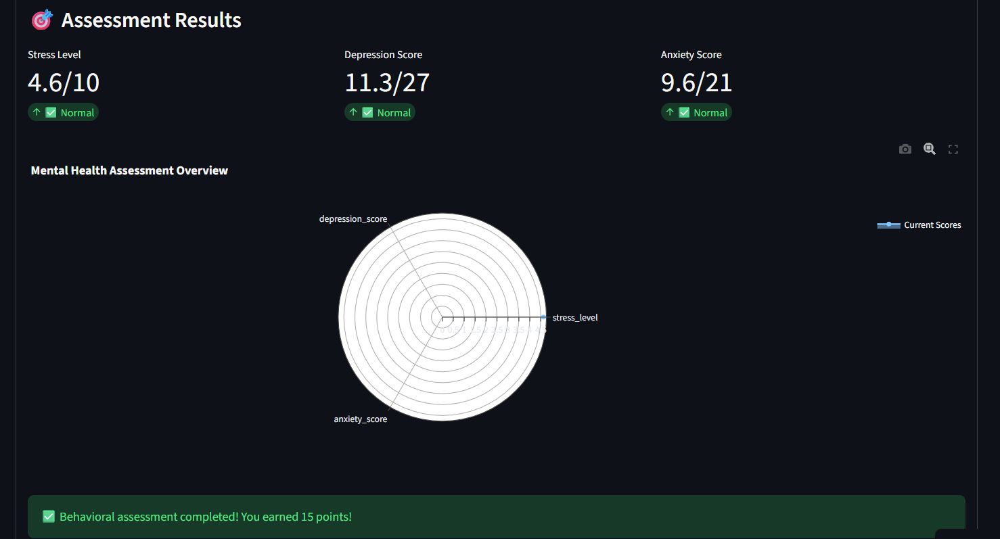
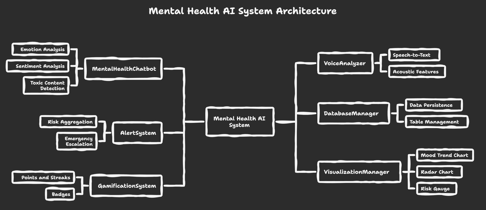
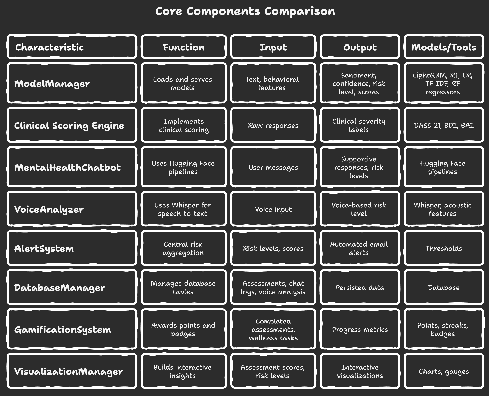

# MindGuard AI: AI-Driven Mental Health Monitoring System for Early Crisis Detection & Proactive Interventions
<br>

**Live Demo:  [Click Here for Live Demo](https://mindgaurd-ai.streamlit.app/)** <div id="top"></div>

<br>

## 📄 Overview

MindGuard AI is an intelligent mental health monitoring system that combines **NLP sentiment analysis**, **behavioral pattern recognition**, and **clinical assessment scoring** to detect early warning signs of mental health crises. 
The system processes multimodal data (text, voice, activity metrics) to create comprehensive user risk profiles and trigger proactive interventions.

---

<br>

## ✨ Key Features

- Real-time sentiment analysis from text & voice inputs
- Behavioral pattern detection (sleep, activity, stress levels)
- Clinical scoring integration (DASS-21, BDI, BAI)
- Explainable AI with SHAP visualizations
- Rule-based mental health chatbot for immediate support
- Early warning system with risk probability scoring
- Automated emergency alert system that instantly emails trusted contacts during high-risk detections.
- Includes danger reason and model confidence score for transparent, data-driven escalation.

---

<br>

## 🧠 **Core Capabilities**

| **Module** | **Functionality** | **Data Sources** |
|------------|------------------|------------------|
| **Sentiment Analyzer** | NLP-based emotion detection | Text inputs, social media, chat logs |
| **Voice Stress Detector** | Audio feature extraction for stress | Voice recordings, call analysis |
| **Behavioral Tracker** | Pattern recognition in daily metrics | Sleep data, activity levels, screen time |
| **Risk Profiler** | Multi-factor risk scoring | Clinical scales + behavioral data |
| **Intervention Bot** | Personalized support responses | Rule-based + ML recommendations |
| **Explainability Layer** | Model transparency | SHAP values, feature importance |

---

<br>

## 🖼️ Visual Demonstration

Here are some visuals showcasing the application's interface and capabilities:


<div style="display: flex; flex-wrap: wrap; justify-content: space-around; gap: 10px;">
  <div style="flex: 1 1 300px; max-width: 48%; text-align: center; border: 1px solid #eee; padding: 5px;">
    <br>
    <p><b>Streamlit App Interface</b></p>
    <br>
    
  </div>
  <hr style="border: none; background-color: #ccc; height: 0.1px; margin: 20px 0;">
  
  <div style="flex: 1 1 300px; max-width: 48%; text-align: center; border: 1px solid #eee; padding: 5px;">
    <br>
    <p><b>Prediction Details</b></p>
    <br>
    
  </div>
</div>


---

<br>

## 📊 Datasets

MindGuard AI uses two comprehensive datasets enabling accurate mental health prediction, behavioral analysis, and NLP-based sentiment classification.

### **1. Anxiety–Depression Behavioral Dataset (`anxiety_depression_dataset.csv`)**

A structured dataset focused on demographic, lifestyle, psychological, and medical indicators related to anxiety, depression, and stress.  
Used for behavioral ML models that predict Stress Level, Depression Score, and Anxiety Score.

#### **Columns & Descriptions**

| Column Name | Description |
|-------------|-------------|
| **Age** | Age of the individual in years. |
| **Gender** | Gender encoded as numeric categories. |
| **Education_Level** | Highest education level (e.g., High School, Bachelor’s). |
| **Employment_Status** | Current employment category (Employed, Student, Unemployed, etc.). |
| **Sleep_Hours** | Average sleep duration per night. |
| **Physical_Activity_Hrs** | Weekly duration of physical activity. |
| **Social_Support_Score** | Perceived social support on a scale (1–10). |
| **Anxiety_Score** | Measured or self-reported anxiety level. |
| **Depression_Score** | Measured or self-reported depression severity. |
| **Stress_Level** | Overall stress rating (model target or self-reported). |
| **Family_History_Mental_Illness** | Whether mental illness exists in family history (0/1). |
| **Chronic_Illnesses** | Presence of chronic diseases affecting mental health (0/1). |
| **Medication_Use** | Whether the individual is taking mental-health-related medication (0/1). |
| **Therapy** | Participation in therapy or counseling sessions (0/1). |
| **Meditation** | Whether meditation is practiced frequently (0/1). |
| **Substance_Use** | Level of substance usage (None, Occasional, Regular). |
| **Financial_Stress** | Self-reported financial pressure level (1–10). |
| **Work_Stress** | Work-related stress score (1–10). |
| **Self_Esteem_Score** | Confidence and self-worth rating (1–10). |
| **Life_Satisfaction_Score** | Happiness and life satisfaction level (1–10). |
| **Loneliness_Score** | Measure of loneliness experienced (1–10). |

<br>

### **2. Multi-Source Mental Health Text Dataset (`Combined_Data.csv`)**

A curated dataset combining multiple Kaggle datasets containing real-world text data—from Reddit, Twitter, and conversation datasets—tagged with mental health labels.

Used for NLP classification models, suicide-risk detection, and chatbot intelligence.


#### **Columns & Descriptions**

| Column Name | Description |
|-------------|-------------|
| **unique_id** | Unique identifier for each data entry. |
| **Statement** | The written text/post expressing thoughts, feelings, or mental state. |
| **Mental Health Status** | The assigned category such as Normal, Depression, Suicidal, Anxiety, Stress, Bi-Polar, Personality Disorder. |


### **Mental Health Categories Included**

- Normal  
- Depression  
- Suicidal  
- Anxiety  
- Stress  
- Bi-Polar  
- Personality Disorder  


### **Use Cases**

- Training mental-health chatbots  
- Text-based sentiment and risk analysis  
- Behavioral and psychological research  
- Suicidal intent detection models  
- Multi-label mental health classification  

### **Acknowledgments**

This dataset was created by merging and cleaning multiple publicly available Kaggle datasets.  
Gratitude to the original dataset creators for contributing to open mental health research.

---

<br>

## ⚙️ System Architecture & Logic Flow

The Krishniti AI platform is built around a sophisticated multi-agent system designed to process diverse agricultural data and provide comprehensive recommendations.

<br>
   
**Core Agents:**

1.  **Farmer Input Agent:** Gathers and processes farm-specific data from the farmer.
2.  **Environmental Analysis Agent:** Analyzes soil, temperature, and rainfall data to assess environmental suitability.
3.  **Crop Recommendation Agent:** Uses machine learning models to predict optimal crop performance based on environmental factors.
4.  **Market Analysis Agent:** Analyzes current market trends and pricing to maximize profitability.
5.  **Sustainability Optimization Agent:** Recommends practices to improve environmental sustainability and resource efficiency.
6.  **Decision Integration Agent:** Synthesizes information from all preceding agents to generate final, balanced recommendations.


<br>

<div style="display: flex; flex-wrap: wrap; justify-content: space-around; gap: 10px;">
    <div style="flex: 1 1 300px; max-width: 48%; text-align: center; border: 1px solid #eee; padding: 5px;">
        <div align="center">
          
        </div>    
    </div>
</div>

<br>

<div style="display: flex; flex-wrap: wrap; justify-content: space-around; gap: 10px;">
    <div style="flex: 1 1 300px; max-width: 48%; text-align: center; border: 1px solid #eee; padding: 5px;">
        <div align="center">
          
        </div>    
    </div>
</div>

---

<br>

## 💻 Technologies Used

This project leverages a focused set of key technologies:

* **Streamlit:** Interactive web dashboard for farmer inputs and AI-driven recommendations.
* **Python 3.x:** Core programming language for agents, pipelines, and backend logic.
* **Scikit-learn:** Used for Random Forest models powering yield prediction and sustainability scoring.
* **Pandas:** Handles data processing, cleaning, and CSV dataset loading.
* **NumPy:** Performs numerical operations for environmental scoring and resource optimization.
* **SQLite:** Persistent local database for farm profiles, inputs, and recommendation history.
* **SQLAlchemy / sqlite3:** Manages database connection, queries, and ORM-like interactions.
* **OOP Python Classes:** Implements 6 modular AI agents following clean architecture and SRP principles.
* **Custom Data Pipelines:** Orchestrated through the `SustainableFarmingSystem` for multi-agent coordination.
* **Jupyter:** Used for dataset exploration, feature engineering, and model training.
* **Git & GitHub:** Version control, and project repository hosting.

---

<br>

## 📂 Project Structure

All core files for this project are organized in the root directory:

```bash
├── images/                           # Visual assets and system diagrams used in the README
│   ├── ai-agents.png                 # Diagram showing the multi-agent architecture
│   ├── dataflow.png                  # End-to-end system dataflow illustration
│   ├── home.png                      # Screenshot of the main interface/dashboard
│   └── prediction.png                # Screenshot of prediction/recommendation output
│
├── app.py                            # Main application script for the Krishniti AI system
├── app.ipynb                         # Notebook exploration of the application logic
├── sustainable_farming_system.py     # Core multi-agent architecture and orchestration
├── sustainable_farming_system.ipynb  # Notebook for system development, testing, and debugging
│
├── farmer_advisor_dataset.csv        # Dataset containing farm-level environmental and input data
├── marketer_researcher_dataset.csv   # Dataset containing market, demand, and economic indicators
├── farming_agents.db                 # SQLite database storing persistent farm profiles and history
│
├── requirements.txt                  # Python dependencies required to run the project
├── LICENSE                           # License information for legal usage and distribution
└── README.md                         # Main documentation and setup instructions
```

---

<br>

## 🚀 Getting Started

These instructions will give you a copy of the project up and running on
your local machine for development and testing purposes.

### Prerequisites

Requirements for the software and other tools to build, test and push 
- Python 3.8+ (preferably 3.11)

### Installation

1.  **Clone the Repository:**
   
    ```bash
    git clone https://github.com/dharambirsinghsidhu/Krishniti-AI.git
    cd Krishniti-AI
    ```

2.  **Create and Activate a Virtual Environment:**

    It's highly recommended to use a virtual environment to manage project dependencies.

    ```bash
    python -m venv venv
    ```

    * **On Windows:**
        ```bash
        .\venv\Scripts\activate
        ```
    * **On macOS/Linux:**
        ```bash
        source venv/bin/activate
        ```

3.  **Install Python Dependencies:**

    First, ensure your `pip` installer is up to date, then install the required Python libraries.

    ```bash
    pip install --upgrade pip
    pip install -r requirements.txt
    pip install streamlit
    ```

4.  **Run the Application:**

    Launch the Streamlit interface:

    ```bash
    streamlit run app.py
    ```

---

<br>

## 🤝 Contributing

We warmly welcome contributions to this project! If you're interested in improving the model, enhancing the user interface, or adding new functionalities, please follow these general steps:

1.  Fork the repository.
2.  Create a new branch for your feature (`git checkout -b feature/YourAwesomeFeature`).
3.  Commit your changes (`git commit -m 'Add a new feature'`).
4.  Push to your branch (`git push origin feature/YourAwesomeFeature`).
5.  Open a Pull Request, describing your changes in detail.

Please make sure your code adheres to good practices and includes relevant tests if applicable.

---

<br>

## 📧 Contact

For any questions or collaborations, feel free to reach out to the project maintainer:

* **Dharambir Singh Sidhu:** dharambirsinghsidhu.work@gmail.com

<br>

---

<br>

<div style="display: flex; flex-wrap: wrap; justify-content: space-around; gap: 10px;">
    <div style="flex: 1 1 300px; max-width: 48%; text-align: center; border: 1px solid #eee; padding: 5px;">
        <div align="center">
              <div>© 2025 Dharambir Singh Sidhu. Licensed under the <a href="./LICENSE">MIT License</a>.</div>
          <br>
          🔹<a href="#top"> Back to Top </a>🔹
        </div>    
    </div>
</div>

<br>

---
